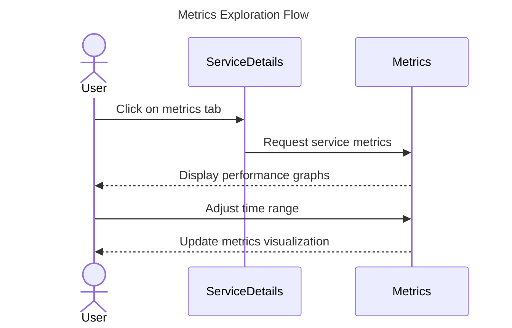
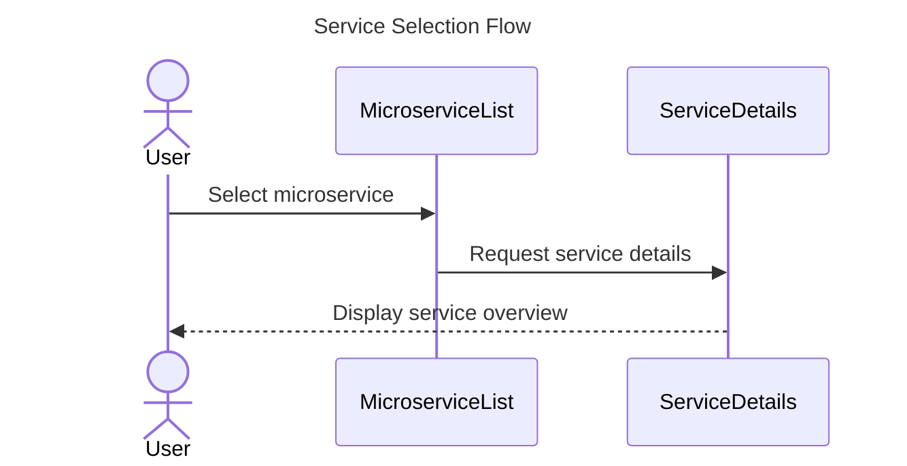
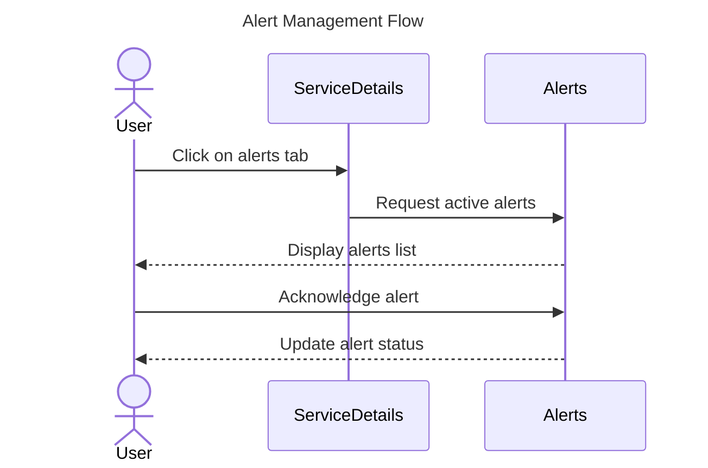
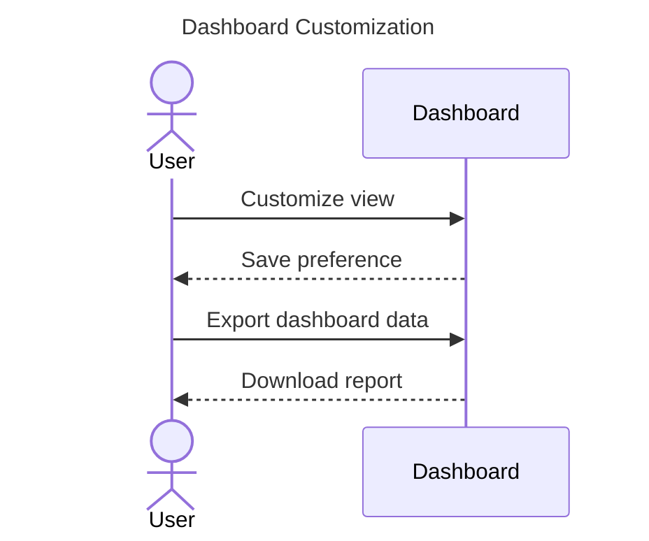
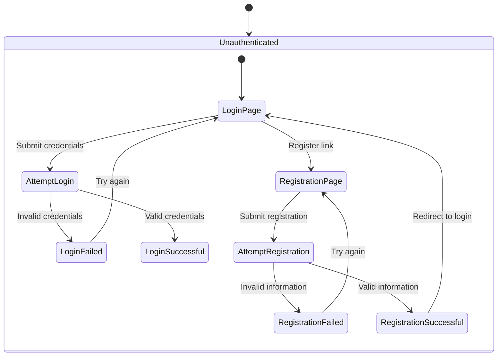
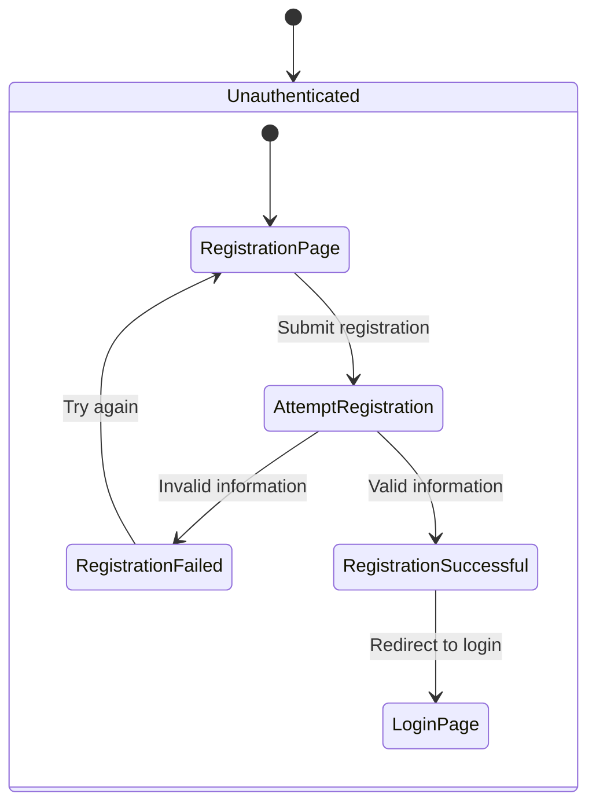
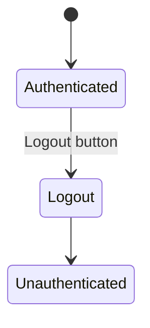
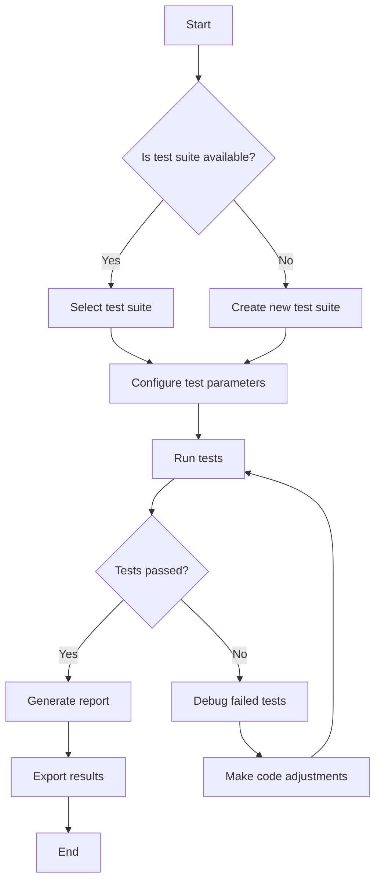

# User Behavior Diagrams

This document contains UML diagrams illustrating the expected user behavior and flow through the
Poly Micro Manager application.

## Monitoring Dashboard Flow

The monitoring dashboard is a crucial component allowing users to observe and manage microservices
in real-time.

### Metric Exploration Flow

### Service Selection Flow

### Alert Management Flow

### Dashboard Customization Flow

## User Authentication Flow

### Login Flow

### Registration Flow

### Logout Flow

## Microservice Testing Workflow

More diagrams will be added to document additional user flows as the application evolves.
